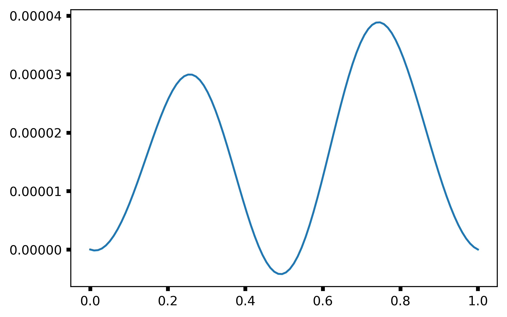

.. _tutorial:

Tutorial
========
In this tutorial, I'll cover ``evilmc``'s basic functionality and describe a
few limitations and caveats. I'll also show how to fit data.

Initializing the Model
----------------------
::

    from evilmc import evparams, evmodel
    import numpy as np
    import matplotlib.pyplot as plt

    ep = evparams(per=1., a=4.15, T0=0.5, p=1./12.85,
        limb_dark='quadratic', u=[0.314709, 0.312125], beta=0.07,
        q=1.10e-3, Kz=1e-6, Ts=6350., Ws=[0.,0.,0.1],
        F0=30e-6, Aplanet=30e-6, phase_shift=0.)

This code block initializes an ``evilmc`` system with the following: 

* period `per` of 1 (arbitrary units)
* semi-major axis `a` that is 4.15 times the host star's radius -- The current version of ``evilmc`` can only deal with circular orbits.
* mid-transit time `T0` of 0.5
* planet-star radius ratio `p` of 1/12.85 (like HAT-P-7 b)
* quadratic `limb-darkening <https://github.com/nespinoza/limb-darkening>`_ 
* limb-darkening parameters `u`
* `gravity-darkening <http://adsabs.harvard.edu/abs/2011A%26A...529A..75C>`_ parameter `beta` of 0.07
* planet-star mass ratio `q` of :math:`1.1\times 10^{-3}`
* radial-velocity amplitude `Kz` which is 1 millionth the speed of light --
  :func:`~evilmc.convert_Kz` is a helper function that can calculate an appropriate `Kz`-value.
* stellar effective temperature `Ts` of 6350 K
* stellar rotation vector `Ws` with x/y/z components of (0, 0, 0.1) -- The
  rotation vector must be in units of the orbital mean motion.
* sinusoidal phase curve defined as :math:`F_0 + A_{\rm planet} \cos\left(2 \pi
  (\phi - {\rm phase\_shift}) \right)`.

The resulting eclipse depth is required to be equal to :math:`F_0 + A_{\rm planet}` by physical consistency.

Running the Model
-----------------
With an initialized :class:`~evilmc.evparams` object, you can calculate just the ellipsoidal variations:

::

    time = np.linspace(0, 1., 100)
    em = evmodel(time, ep)
    signal = em.evilmc_signal()
    plt.plot(time, signal)
    plt.show()

Or you can include both the transit and eclipse:

::

    time = np.linspace(0, 1., 100)
    em = evmodel(time, ep)
    signal = em.all_signals()
    plt.plot(time, signal)
    plt.annotate('transit', 
            xy=(0.5, 0.0), xytext=(0.38, 0.00006), fontsize=24,
            arrowprops=dict(facecolor='black', shrink=0.05))
    plt.annotate('eclipse', 
            xy=(0., 0.0), xytext=(0.025, 0.00008), fontsize=24,
            arrowprops=dict(facecolor='black', shrink=0.05))
    plt.ylim([-0.00001, 0.0001])
    plt.show()

You can also include finite time-sampling effects, which tend to smooth the light curve. To include this effect, initialize a model with the ``supersample_factor`` and ``exp_time`` parameters specified:

::

    em = evmodel(time, ep, supersample_factor=5, exp_time=0.01)

Limitations and Assumptions
-------------------------------------
Especially in this early version of ``evilmc`` (0.1.0), the code is quite
limited. In particular, it 

* cannot handle eccentric orbits
* only includes quadratic `limb-darkening <https://github.com/nespinoza/limb-darkening>`_

One subtlety that isn't usually an issue in transit analyses is how to set the
zero-point in the light curve. For transit light curves (without eclipses or
ellipsoidal variations), we usually set the out-of-transit portion of the light
curve equal to zero or one.

But when we have out-of-transit variations that we actually want to analyze, we
have to choose some other zero-point. The ``evilmc`` code here sets the middle
of the eclipse curve equal to zero, even if the eclipse times don't show up in
the times given. Be sure to condition your data appropriately!
